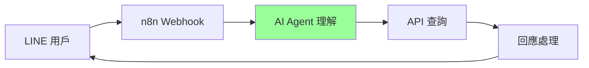
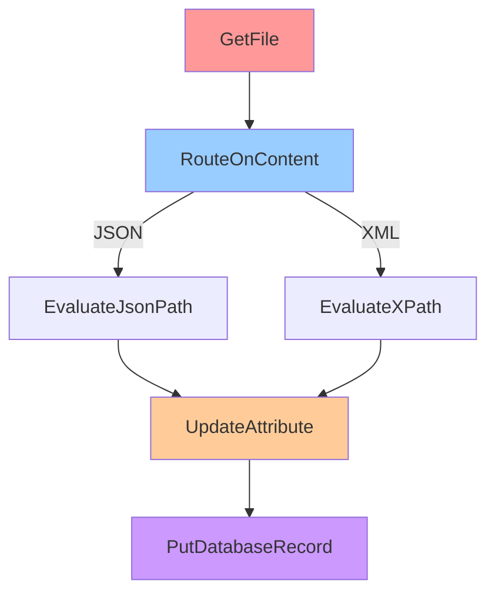

## 前言

在資料處理和工作流程自動化的世界裡，選擇合適的工具往往決定了專案的成敗。最近在把讀經機器人升級為查經助手的過程中，我重新評估了手邊用過的三個自動化工具：**n8n**、**Apache NiFi** 和 **Pentaho Kettle (PDI)**。

每個工具都有其獨特的定位和優勢，今天想和大家分享我的實際使用心得，希望能幫助正在選擇工具的朋友們！

> 本文基於實際使用經驗，提供客觀的工具比較分析 🔍
{: .prompt-info }

## 專案背景：從讀經機器人到查經助手

### 過去的架構與挑戰

**原始技術架構：**
- **後端**：Node.js 服務，部署在 GCP
- **整合方式**：透過 LineBot 呼叫後端 API
- **語言處理**：使用自然語言套件解析用戶訊息
- **主要問題**：自然語言解析經常出現錯誤判斷

### 新的解決方案嘗試

這次選擇 n8n + AI Agent 的原因：
1. **解決語言理解問題**：用 AI Agent 取代傳統自然語言解析
2. **部署簡化**：在 Zeabur 平台上快速部署
3. **功能升級**：從單純的進度查詢升級為智能查經助手
4. **資料策略改變**：資料庫預先處理好，專注於 API 查詢和回應

---

## 工具介紹與使用心得

## 🚀 n8n - 現代化工作流程自動化

### 基本介紹
- **定位**：面向 API 整合的 no-code 自動化平台
- **特色**：視覺化設計、現代化 UI、雲端友善
- **適用場景**：API 自動化、ChatBot、輕量級資料處理

### 實際使用體驗

**部署體驗：**
- **雲端部署超簡單**：在 Zeabur 平台上部署非常容易
- **版本升級輕鬆**：直接修改版本號重啟就完成更新
- **維護成本極低**：連 Dockerfile 都不用碰，雲端託管很省心

**開發體驗：**
- **上手速度快**：有 Kettle 和 NiFi 經驗的話，圖形化介面很熟悉
- **視覺化直觀**：拖拉節點的操作方式很自然
- **AI 整合容易**：透過 HTTP Request 節點輕鬆整合各種 AI 服務
- **錯誤處理簡單**：相比資料轉換工具，錯誤處理複雜度大幅降低

**應用場景：**
- 這次主要用於 API 查詢設計，不像過去做複雜資料轉換
- 專注於 LineBot 整合和 AI Agent 的語言理解
- 資料庫查詢為主，轉換邏輯相對簡單

---

## 🌊 Apache NiFi - 企業級資料流處理

### 基本介紹
- **定位**：大數據即時流處理平台
- **特色**：高可用性、資料血統追蹤、企業級監控
- **適用場景**：IoT 資料收集、即時資料流處理、企業資料整合

### 實際使用體驗

**當時使用場景：**
- **大型資料處理為主**：主要處理企業級的大量資料流
- **容錯率設計**：有 queue 設計，但長時間不處理會有記憶體消耗問題
- **程式碼彈性**：可以在裡面寫程式碼做處理，但通常不做太多細節處理

**優點體驗：**
- **穩定性極佳**：7x24 運行從未出現資料遺失
- **監控完整**：可以看到每個環節的詳細統計
- **容錯能力強**：網路中斷或系統重啟都能自動恢復
- **資料追蹤完整**：知道每筆資料的來源和處理歷程

**挑戰感受：**
- **配置複雜**：光是基本設定就要花半天時間
- **資源消耗大**：最少需要 4GB RAM 才能順暢運行
- **記憶體管理**：queue 設計雖然有容錯，但太久不處理會吃掉記憶體
- **過度工程化**：對於非大型資料處理的場景會有殺雞用牛刀的感覺

*NiFi 典型的資料處理流程*

---

## 📊 Pentaho Kettle (PDI) - 傳統 ETL 王者

### 基本介紹
- **定位**：專業的資料轉換和整合工具
- **特色**：強大的資料轉換能力、豐富的 ETL 組件
- **適用場景**：資料倉儲建設、複雜資料清洗、批次資料處理

### 實際使用體驗

**當時使用背景：**
- **主要用於資料處理**：整個流程都包含複雜的資料轉換步驟
- **工作目標明確**：每個物件的工作目標都很清楚
- **錯誤處理要求高**：因為資料轉換步驟多，錯誤處理需要特別細緻

**優點體驗：**
- **資料轉換功能強大**：各種 Join、Lookup、聚合操作應有盡有
- **資料清洗能力出色**：處理髒資料和格式轉換特別擅長
- **步驟控制精細**：每個轉換步驟都可以細微調整
- **大資料量處理穩定**：百萬級資料處理毫無壓力

**挑戰感受：**
- **介面感覺老舊**：Spoon 工具的 UI 設計停留在過去
- **學習門檻高**：需要理解 ETL 概念和大量組件
- **錯誤處理複雜**：因為轉換步驟多，每個環節都需要細節處理
- **版本管理複雜**：作業版本控制和部署較為繁瑣

*Kettle 細緻的 ETL 處理流程*

---

## 📋 三工具全面比較

### 功能特性比較

| 比較項目       | **n8n**             | **Apache NiFi**    | **Pentaho Kettle** |
| -------------- | ------------------- | ------------------ | ------------------ |
| **主要用途**   | 工作流程自動化      | 即時資料流處理     | ETL 資料轉換       |
| **學習曲線**   | 🟢 容易              | 🟡 中等             | 🔴 困難             |
| **UI 設計**    | 🏆 現代化，直觀      | 功能豐富，稍複雜   | 傳統桌面介面       |
| **資料處理量** | 中小型              | 🏆 大型企業級       | 🏆 大型批次處理     |
| **即時處理**   | 🏆 優秀              | 🏆 專業級           | 🟡 主要批次處理     |
| **API 整合**   | 🟡 HTTP Request 為主 | 🟡 需開發 Processor | 🟡 有限支援         |
| **資料轉換**   | 基礎功能            | 🟡 中等能力         | 🏆 極其強大         |
| **部署方式**   | 🏆 Docker/Cloud 簡單 | 🟡 企業級叢集       | 🟡 桌面/伺服器      |
| **監控能力**   | 基礎監控            | 🏆 企業級監控       | 🟡 有限監控         |
| **雲端友善度** | 🏆 非常友善          | 🟡 需要配置         | 🔴 傳統部署         |

### 技術架構比較

| 技術面向     | **n8n**            | **Apache NiFi**  | **Pentaho Kettle** |
| ------------ | ------------------ | ---------------- | ------------------ |
| **開發語言** | TypeScript/Node.js | Java             | Java               |
| **資源消耗** | 🟢 輕量級           | 🔴 重量級         | 🟡 中等             |
| **擴展性**   | 🟡 水平擴展有限     | 🏆 優秀的叢集擴展 | 🟡 垂直擴展為主     |
| **容錯機制** | 基礎重試機制       | 🏆 完整容錯設計   | 🟡 有限容錯         |
| **版本升級** | 🏆 雲端一鍵升級     | 🟡 需要規劃       | 🟡 手動升級         |
| **AI 整合**  | 🏆 容易整合         | 🟡 需要開發       | 🔴 困難             |

### 適用場景建議

| 使用場景             | 首選工具         | 次選   | 理由                    |
| -------------------- | ---------------- | ------ | ----------------------- |
| **API 自動化整合**   | 🏆 n8n            | -      | 現代化工具，部署簡單    |
| **AI Agent 應用**    | 🏆 n8n            | -      | HTTP 整合靈活，雲端友善 |
| **ChatBot/通知系統** | 🏆 n8n            | -      | 現代化服務支援完整      |
| **IoT 即時資料收集** | 🏆 Apache NiFi    | n8n    | 企業級穩定性和監控      |
| **大量資料 ETL**     | 🏆 Pentaho Kettle | NiFi   | 資料轉換功能最完整      |
| **資料倉儲建設**     | 🏆 Pentaho Kettle | -      | 專業 ETL 工具           |
| **企業資料整合**     | 🏆 Apache NiFi    | Kettle | 即時處理+企業級監控     |
| **原型快速開發**     | 🏆 n8n            | -      | 上手快，迭代容易        |

### 成本考量比較

| 成本類型     | **n8n**      | **Apache NiFi** | **Pentaho Kettle** |
| ------------ | ------------ | --------------- | ------------------ |
| **學習成本** | 🟢 低         | 🟡 中            | 🔴 高               |
| **部署成本** | 🟢 雲端簡單   | 🔴 基礎設施複雜  | 🟡 中等             |
| **維護成本** | 🟢 視覺化維護 | 🟡 需專業維護    | 🔴 需專業人員       |
| **硬體需求** | 🟢 最低       | 🔴 較高          | 🟡 中等             |

---

## 結論與建議

經過實際使用這三個工具，以及這次 n8n 的 AI Agent 實驗，我的心得是：

> **工具選擇要根據具體場景和技術發展趨勢** 🎯
{: .prompt-tip }

### 選擇建議

**根據專案需求：**
1. **API 整合 + AI Agent**：n8n 是很好的選擇
2. **企業級資料流處理**：Apache NiFi 依然是首選
3. **複雜資料轉換需求**：Pentaho Kettle 無可取代
4. **雲端部署便利性**：n8n + 現代雲平台的組合很棒

**根據團隊背景：**
- **前端開發者**：選擇 n8n
- **Java 開發者**：NiFi 或 Kettle 都合適
- **資料分析師**：Kettle 最符合需求
- **非技術背景**：n8n 門檻最低

### 技術發展觀察

- **圖形化工具成熟**：從 Kettle、NiFi 到 n8n，圖形化介面越來越友善
- **AI 整合趨勢**：傳統自然語言處理被 AI Agent 取代的趨勢明顯
- **雲端原生化**：現代工具的部署和維護體驗大幅提升
- **專業分工明確**：每個工具都有其擅長的領域，不需要追求全能

### 個人使用建議

1. **入門學習**：從 n8n 開始，建立自動化思維
2. **專業深入**：根據實際需求選擇專業工具
3. **持續關注**：自動化和 AI 整合發展很快，保持學習

---

*下一篇文章會分享「n8n 實戰：LineBot + AI Agent 完整實作指南」，敬請期待！* 🚀

*你使用過這些工具嗎？歡迎在留言區分享你的經驗！* 💬