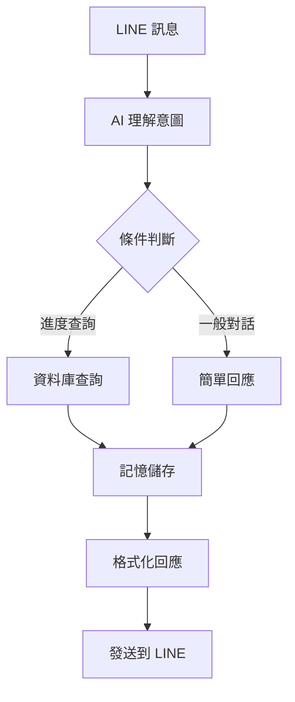
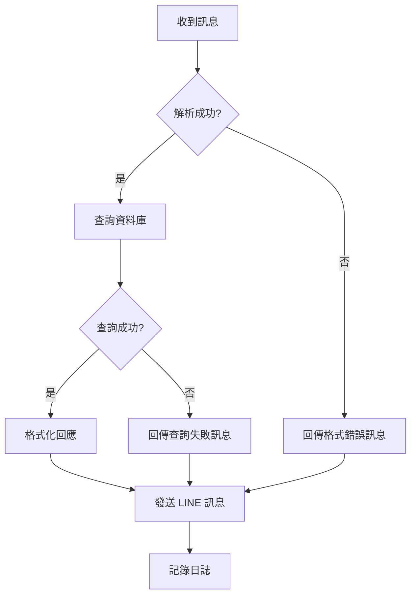

## 前言

最近把之前用傳統後端架設的 LineBot 讀經進度查詢機器人遷移到 n8n 平台，整個過程讓我深刻體會到 no-code 工具的威力！從原本需要 2-3 天的開發時間，縮短到半天就能完成部署。

今天想和大家分享完整的實作過程，包括詳細的設定步驟和一些實用的資源捷徑 🛠️

> 本文提供完整的實作指南，適合想要學習 n8n 和 LineBot 整合的朋友！
{: .prompt-info }

## n8n 實際工作流程架構

### 完整流程圖解析

根據我在 n8n 中建立的實際工作流程，整個系統的架構如下：


*實際的 n8n 工作流程圖*

### 流程節點詳細說明

#### **1. 訊息接收階段**
- **When chat message received (Deactivated)**：處理 LINE Webhook 訊息
- **專案設計**：負責接收並解析來自 LINE 的用戶訊息

#### **2. AI 智能處理核心**
整個流程的核心是多層 AI 處理架構：

**Anthropic Chat Model（主要 AI 引擎）**
- 使用 Claude AI 進行自然語言理解
- 取代過去容易出錯的自然語言套件
- 負責理解用戶的查經需求和意圖

**Anthropic Chat(Simple Memory) Model**
- 提供對話記憶功能
- 讓查經助手能記住對話上下文
- 使互動更自然流暢

**ChatGPT 節點**
- 作為備用或特定功能的 AI 處理
- 可能用於不同類型的查經問題

#### **3. 資料處理與記憶管理**
**Simple Memory 節點**
- 儲存對話歷史和用戶偏好
- 記錄查經進度和習慣

**JMESPath-NodeSplit 節點**
- 處理 JSON 資料的解析和轉換
- 確保資料格式正確傳遞

#### **4. 條件判斷與分流**
**篩選資料節點**
- 根據 AI 理解的結果進行條件判斷
- 決定後續的處理路徑

**篩選器件**
- 進一步的條件篩選
- 確保回應的準確性

#### **5. 回應生成與發送**
**Code 節點**
- 最終的回應格式化
- 將 AI 生成的內容轉換為 LINE 訊息格式

**第一欄**
- 可能是最終的訊息輸出節點
- 負責將處理結果發送回 LINE

### 架構設計亮點

#### **1. 多 AI 模型協作**
這個設計最大的特色是使用了多個 AI 模型：
- **Anthropic Claude**：主要的語言理解引擎
- **Simple Memory**：提供上下文記憶能力

#### **2. 記憶機制設計**
- **Simple Memory** 節點讓機器人能記住對話歷史
- 使用者不需要重複說明背景
- 提供更個人化的查經建議

#### **3. 分層處理邏輯**


#### **4. 容錯與分流設計**
- 多個篩選節點確保資料正確性
- AI 處理失敗時有備用路徑
- 記憶功能出錯不影響基本查經功能

### 與傳統架構的對比

| 處理階段     | 舊架構 (Node.js)         | 新架構 (n8n + AI)      |
| ------------ | ------------------------ | ---------------------- |
| **語言理解** | 自然語言套件（容易錯誤） | 多 AI 模型（準確度高） |
| **對話記憶** | 無或需要自建             | Simple Memory 節點     |
| **錯誤處理** | 需要寫程式碼             | 視覺化條件節點         |
| **擴展性**   | 需要重新部署             | 拖拉節點即可           |
| **維護性**   | 需要程式知識             | 視覺化調整             |

## 實作步驟詳解

### 步驟 1：n8n 環境準備

**Docker 快速部署：**
```bash
# 建立 docker-compose.yml
version: '3.8'
services:
  n8n:
    image: n8nio/n8n
    restart: always
    ports:
      - "5678:5678"
    environment:
      - N8N_BASIC_AUTH_ACTIVE=true
      - N8N_BASIC_AUTH_USER=admin
      - N8N_BASIC_AUTH_PASSWORD=your_password
      - WEBHOOK_URL=https://your-domain.com
    volumes:
      - n8n_data:/home/node/.n8n

volumes:
  n8n_data:
```

```bash
# 啟動服務
docker-compose up -d

# 檢查狀態
docker-compose logs n8n
```

> **安全提醒**：記得設定強密碼並使用 HTTPS！
{: .prompt-warning }

## 關鍵實作細節

### AI Agent 配置重點

基於實際的工作流程，這裡分享一些關鍵的配置細節：

#### **1. Anthropic Claude 配置**
```javascript
// AI 提示詞設計（在 Anthropic Chat Model 節點中）
const systemPrompt = `
你是一個專業的查經助手，具備以下能力：
1. 理解用戶的查經需求和問題
2. 提供準確的聖經解釋和背景知識
3. 記住對話歷史，提供連貫的建議
4. 用溫暖、鼓勵的語調回應

請根據用戶的問題，提供有幫助的查經指導。
`;

// 用戶訊息處理
const userMessage = $node["When chat message received"].json.message.text;
```

#### **2. Simple Memory 記憶機制**
```javascript
// 在 Simple Memory 節點中儲存對話歷史
const conversationHistory = {
  userId: $node["When chat message received"].json.source.userId,
  timestamp: new Date().toISOString(),
  userMessage: userMessage,
  aiResponse: aiGeneratedResponse,
  context: {
    currentStudyTopic: extractedTopic,
    userPreferences: userPrefs
  }
};

// 儲存到記憶中
$memory.set(`conversation_${userId}`, conversationHistory);
```

#### **3. 條件分流邏輯**
在篩選節點中的判斷邏輯：

```javascript
// 根據 AI 理解的意圖進行分流
const aiResponse = $node["Anthropic Chat Model"].json;
const intent = aiResponse.intent || "general";

// 分流邏輯
if (intent.includes("查經問題")) {
  return [{ json: { route: "study", data: aiResponse } }];
} else if (intent.includes("進度查詢")) {
  return [{ json: { route: "progress", data: aiResponse } }];
} else {
  return [{ json: { route: "general", data: aiResponse } }];
}
```

### 錯誤處理與容錯設計

#### **多層容錯機制**
1. **AI 服務失敗**：自動切換到備用 AI 模型
2. **記憶功能異常**：不影響基本查經功能
3. **資料格式錯誤**：JMESPath 節點進行資料清洗
4. **網路問題**：內建重試機制

#### **監控與除錯**
```javascript
// 在關鍵節點添加日誌
console.log("AI處理結果:", {
  timestamp: new Date().toISOString(),
  userId: userId,
  intent: extractedIntent,
  confidence: confidenceScore,
  processingTime: Date.now() - startTime
});
```

### 步驟 3：n8n Workflow 建構

#### 3.1 Webhook 接收節點

```json
{
  "httpMethod": "POST",
  "path": "linebot",
  "responseMode": "responseNode",
  "options": {}
}
```

#### 3.2 訊息解析節點 (Code Node)

```javascript
// 解析 LINE Webhook 資料
const body = $node["Webhook"].json["body"];
const events = body.events;

if (!events || events.length === 0) {
  return [];
}

const event = events[0];
const messageText = event.message?.text || "";
const replyToken = event.replyToken;
const userId = event.source.userId;

// 判斷查詢類型
let queryType = "unknown";
if (messageText.includes("今日") || messageText.includes("today")) {
  queryType = "daily";
} else if (messageText.includes("本週") || messageText.includes("week")) {
  queryType = "weekly";
} else if (messageText.includes("進度") || messageText.includes("progress")) {
  queryType = "progress";
}

return [{
  json: {
    replyToken,
    userId,
    messageText,
    queryType,
    timestamp: new Date().toISOString()
  }
}];
```

#### 3.3 資料庫查詢節點

**如果使用外部資料庫：**
```javascript
// 根據查詢類型執行不同的資料庫查詢
const { queryType, userId } = $node["Parse Message"].json;

let query = "";
let responseData = {};

switch (queryType) {
  case "daily":
    // 查詢今日讀經進度
    query = `SELECT * FROM reading_progress 
             WHERE user_id = '${userId}' 
             AND date = CURDATE()`;
    break;
    
  case "weekly":
    // 查詢本週讀經進度
    query = `SELECT * FROM reading_progress 
             WHERE user_id = '${userId}' 
             AND YEARWEEK(date) = YEARWEEK(NOW())`;
    break;
    
  case "progress":
    // 查詢整體進度
    query = `SELECT COUNT(*) as completed,
             (SELECT COUNT(*) FROM reading_plan) as total
             FROM reading_progress 
             WHERE user_id = '${userId}'`;
    break;
    
  default:
    responseData = {
      text: "請輸入有效的查詢指令：\n• 今日進度\n• 本週進度\n• 整體進度"
    };
}

return [{ json: { query, responseData, queryType } }];
```

#### 3.4 回應格式化節點

```javascript
// 格式化 LINE 回應訊息
const { queryType, responseData } = $node["Database Query"].json;
const replyToken = $node["Parse Message"].json.replyToken;

let replyMessage = {};

switch (queryType) {
  case "daily":
    replyMessage = {
      type: "text",
      text: `📖 今日讀經進度\n\n` +
            `📚 已完成：${responseData.completed || 0} 章\n` +
            `⏰ 更新時間：${new Date().toLocaleString('zh-TW')}\n\n` +
            `💪 繼續加油！`
    };
    break;
    
  case "weekly":
    replyMessage = {
      type: "text", 
      text: `📅 本週讀經進度\n\n` +
            `📊 本週完成：${responseData.weeklyTotal || 0} 章\n` +
            `🎯 週目標：7 章\n` +
            `📈 完成率：${Math.round((responseData.weeklyTotal || 0) / 7 * 100)}%\n\n` +
            `${responseData.weeklyTotal >= 7 ? '🎉 本週目標達成！' : '💪 繼續努力！'}`
    };
    break;
    
  case "progress":
    const percentage = Math.round((responseData.completed / responseData.total) * 100);
    replyMessage = {
      type: "text",
      text: `📊 整體讀經進度\n\n` +
            `✅ 已完成：${responseData.completed} 章\n` +
            `📖 總計：${responseData.total} 章\n` +
            `📈 完成率：${percentage}%\n\n` +
            `${'▓'.repeat(Math.floor(percentage/10))}${'░'.repeat(10-Math.floor(percentage/10))} ${percentage}%\n\n` +
            `🙏 感謝主的帶領！`
    };
    break;
    
  default:
    replyMessage = responseData;
}

return [{
  json: {
    replyToken,
    messages: [replyMessage]
  }
}];
```

#### 3.5 LINE Reply 節點

```javascript
// 發送回應到 LINE
const { replyToken, messages } = $node["Format Response"].json;

const replyData = {
  replyToken: replyToken,
  messages: messages
};

// 設定 LINE API Headers
const headers = {
  'Content-Type': 'application/json',
  'Authorization': `Bearer ${$vars.LINE_CHANNEL_ACCESS_TOKEN}`
};

return [{
  json: replyData,
  headers: headers
}];
```

### 步驟 4：錯誤處理與監控

#### 4.1 錯誤處理流程



#### 4.2 監控設定

**在 n8n 中設定監控：**
- **執行歷史**：保留最近 100 次執行記錄
- **錯誤通知**：設定失敗時發送 Email 通知
- **效能監控**：記錄每個節點的執行時間

> **監控小技巧**：可以在關鍵節點加入 Webhook 通知，即時掌握系統狀況！
{: .prompt-tip }
